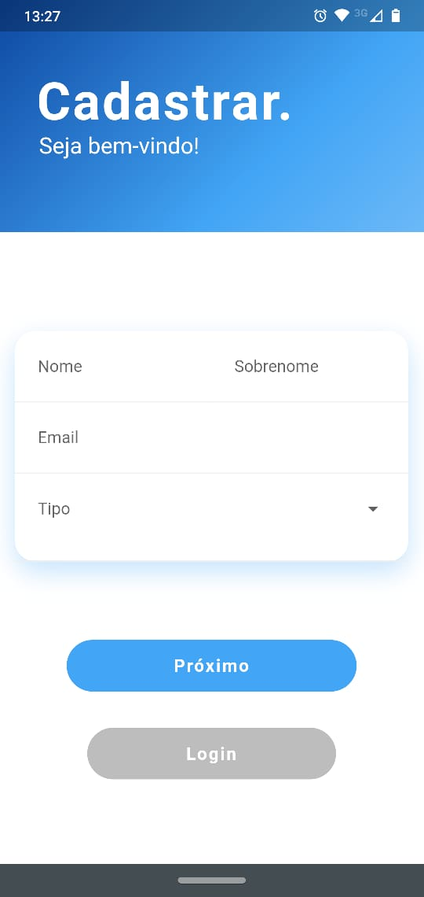
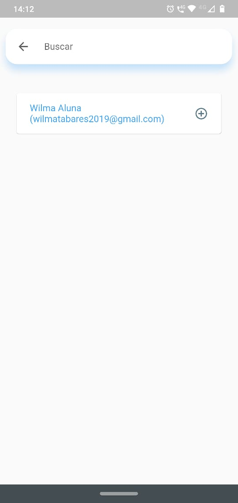
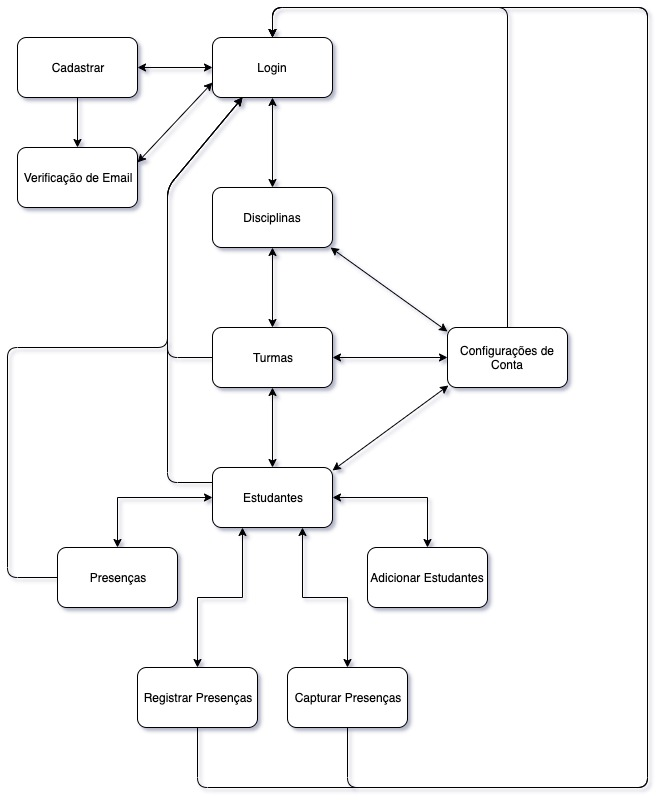

	

# Tô Presente App

Um aplicativo em Flutter para registro de frequência através de reconhecimento facial.

## REQUISITOS
- Flutter: >=2.7.0 <3.0.0

## SOBRE O APP

Este app tem o objetivo de facilitar o processo de registro de frequência de aulas através do reconhecimento facial. Os usuários poderão manter os registros de alunos(as), disciplinas, turmas e frequência dos(as) alunos(as) através de seleção manual ou reconhecimento facial de imagens da câmera obtidas em tempo real.

## FUNCIONALIDADES

Os recursos deste aplicativo incluem:

- Usuários
  - Cadastro
  - Login
  - Alterar Nome
  - Alterar Senha
- Disciplinas
  - Cadastro
  - Listagem
  - Remoção
- Turmas
  - Cadastro
  - Listagem
  - Remoção
- Alunos
  - Cadastro (Envio de informações ao professor)
  - Adicionar um aluno(a) em uma turma
  - Listagem de alunos(as) de uma turma
  - Remover alunos(as) de uma turma
- Frequência Escolar
  - Registro de presença
     - Através de seleção manual
     - Através de reconhecimento facial de imagens da câmera obtidas em tempo real
  - Listagem de presenças de um(a) aluno(a) para uma determinada turma de uma determinanda disciplina

## Vídeos

### Marketing

### Demonstrativo

  
## DOCUMENTAÇÃO

### Telas

	
	
	

	
	
	

	
	
	
	

	
	
	
	

	
	
	
	

	
	
	
	

	
	
	
	

	
	
	

### Widget Tree

	

### Diagrama de Navegação

	

## AUTOR

Emeson Pereira
